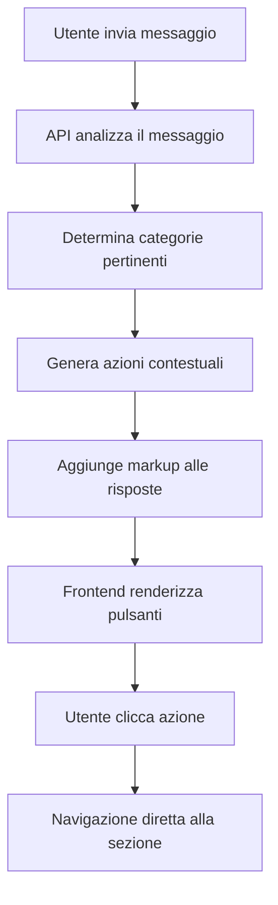

# Azioni Contestuali AI Assistant

## 📋 Panoramica

Il sistema di **Azioni Contestuali** migliora l'esperienza utente dell'AI Assistant aggiungendo automaticamente pulsanti di azione pertinenti alle risposte dell'AI. Quando l'utente fa domande specifiche su spese, itinerario, alloggi o trasporti, il sistema suggerisce automaticamente link diretti alle sezioni appropriate dell'applicazione.

## 🎯 Obiettivi

- **Migliorare l'UX**: Fornire accesso rapido alle sezioni pertinenti
- **Ridurre i click**: Eliminare la navigazione manuale
- **Aumentare l'engagement**: Rendere l'AI Assistant più utile e interattivo
- **Contestualizzazione intelligente**: Suggerire azioni basate sul contenuto della conversazione

## 🏗️ Architettura

### Componenti Principali

1. **ContextualActionButtons.tsx**: Componente UI per renderizzare i pulsanti di azione
2. **contextualActionsService.ts**: Servizio per analizzare i messaggi e determinare le azioni
3. **FormattedAIResponse.tsx**: Componente aggiornato per supportare le azioni contestuali
4. **API Chat Route**: Endpoint aggiornato per includere le azioni nelle risposte

### Flusso di Funzionamento



## 🔍 Analisi del Contesto

### Categorie Riconosciute

#### 💰 Spese (Expenses)
**Keywords**: spese, costo, budget, soldi, pagato, rimborso, saldo, debito, bilancio, prezzo, fattura, ricevuta

**Azioni Suggerite**:
- Vedi Spese → `/trips/{id}/expenses`
- Saldi → `/trips/{id}/expenses?tab=balances`
- Aggiungi Spesa → Modal di aggiunta spesa

#### 📅 Itinerario (Itinerary)
**Keywords**: itinerario, programma, attività, pianificazione, agenda, giorno, orario, visita, tour, attrazioni

**Azioni Suggerite**:
- Vedi Itinerario → `/trips/{id}/itinerary`
- Vista Calendario → `/trips/{id}/itinerary?view=calendar`

#### 🏨 Alloggi (Accommodations)
**Keywords**: alloggio, hotel, albergo, dove dormiamo, camera, prenotazione, check-in, check-out

**Azioni Suggerite**:
- Vedi Alloggi → `/trips/{id}/accommodations`

#### 🚗 Trasporti (Transportation)
**Keywords**: trasporto, viaggio, volo, treno, bus, auto, taxi, metro, aeroporto, stazione, biglietto

**Azioni Suggerite**:
- Vedi Trasporti → `/trips/{id}/transportation`

#### 🗺️ Panoramica (Overview)
**Keywords**: panoramica, riassunto, generale, tutto, completo, informazioni, dettagli

**Azioni Suggerite**:
- Panoramica Viaggio → `/trips/{id}`

### Algoritmo di Confidenza

Il sistema calcola un punteggio di confidenza basato su:

1. **Numero di keyword corrispondenti** (0.2 per keyword, max 1.0)
2. **Sezione corrente** (+0.3 se l'utente è già nella sezione pertinente)
3. **Contesto misto** (bonus per messaggi che toccano più categorie)

**Soglia minima**: 0.3 (30% di confidenza per mostrare le azioni)

## 🎨 Design e UI

### Stili dei Pulsanti

- **Primary**: Gradiente indigo-purple per azioni principali
- **Secondary**: Sfondo slate con bordo per azioni secondarie  
- **Outline**: Sfondo trasparente con bordo per azioni aggiuntive

### Layout Responsivo

- **Desktop**: Layout orizzontale con flex-wrap
- **Mobile**: Layout verticale o griglia 2x2
- **Animazioni**: Hover effects, scale transforms, ripple effects

### Accessibilità

- Supporto per screen readers
- Navigazione da tastiera
- Contrasto colori ottimizzato
- Tooltips descrittivi

## 🔧 Implementazione Tecnica

### Formato Markup

Le azioni vengono codificate nel testo della risposta AI usando questo formato:

```
[CONTEXTUAL_ACTIONS:Label1|type|href|description;;Label2|type|href|description]
```

**Esempio**:
```
[CONTEXTUAL_ACTIONS:Vedi Spese|link|/trips/123/expenses|Visualizza tutte le spese del viaggio;;Saldi|link|/trips/123/expenses?tab=balances|Controlla i saldi e i rimborsi]
```

### Parsing e Rendering

1. **FormattedAIResponse** estrae il markup dalle risposte
2. **parseContextualActions** converte il markup in oggetti ContextualAction
3. **ContextualActionButtons** renderizza i pulsanti con stili appropriati

### Gestione Errori

- Try-catch su tutti i livelli di parsing
- Fallback graceful se il parsing fallisce
- Log di debug per troubleshooting
- Validazione dei tipi di azione

## 📊 Esempi di Utilizzo

### Esempio 1: Domanda sulle Spese
**Input**: "Quanto ho speso finora?"
**Analisi**: 
- Categoria: expenses
- Confidenza: 0.8
- Azioni: Vedi Spese, Saldi, Aggiungi Spesa

### Esempio 2: Domanda sull'Itinerario
**Input**: "Cosa facciamo domani?"
**Analisi**:
- Categoria: itinerary
- Confidenza: 0.6
- Azioni: Vedi Itinerario, Vista Calendario

### Esempio 3: Domanda Mista
**Input**: "Quanto abbiamo speso per gli alloggi?"
**Analisi**:
- Categorie: expenses, accommodations
- Confidenza: 1.0
- Azioni: Vedi Spese, Vedi Alloggi, Saldi

## 🚀 Benefici

### Per gli Utenti
- **Navigazione più rapida**: Click diretti alle sezioni pertinenti
- **Esperienza fluida**: Meno interruzioni nel flusso di lavoro
- **Scoperta di funzionalità**: Esposizione a sezioni meno utilizzate

### Per l'Applicazione
- **Maggiore engagement**: Utenti più attivi nelle diverse sezioni
- **Riduzione del bounce rate**: Meno abbandoni durante la navigazione
- **Migliore UX**: Interfaccia più intelligente e reattiva

## 🔮 Sviluppi Futuri

### Miglioramenti Pianificati

1. **Machine Learning**: Apprendimento dai pattern di utilizzo
2. **Personalizzazione**: Azioni basate sulle preferenze utente
3. **Azioni Dinamiche**: Generazione di azioni basate sui dati del trip
4. **Integrazione Deeplink**: Link diretti a elementi specifici (spesa, attività)
5. **Analytics**: Tracking dell'efficacia delle azioni suggerite

### Estensioni Possibili

- **Azioni per Admin**: Funzionalità specifiche per amministratori
- **Azioni Collaborative**: Inviti e condivisioni rapide
- **Azioni Temporali**: Suggerimenti basati su date e orari
- **Azioni Geografiche**: Suggerimenti basati sulla posizione

## 📝 Note di Implementazione

- Il sistema è completamente opt-in e non interferisce con le funzionalità esistenti
- Le azioni vengono mostrate solo se la confidenza supera la soglia minima
- Il parsing è robusto e gestisce gracefully errori di formato
- I log di debug facilitano il troubleshooting e l'ottimizzazione

---

*Questo sistema rappresenta un significativo miglioramento dell'esperienza utente, rendendo l'AI Assistant non solo informativo ma anche actionable.*
